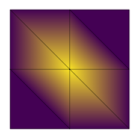

# run_elmer

Run Elmer FEM from Python.

## Installation

```
pip install run_elmer
```

## Usage


```python
import run_elmer as elmer

m = elmer.mesh(
    [[0, 0],
     [0, 1],
     [1, 0],
     [1, 1]],
    [[0, 1, 2],
     [1, 2, 3]]
).refined()

m  # use in Elmer?
```


```python
out = elmer.run(m, """
Header
  Mesh DB "." "."
End

Simulation
  Max Output Level = 5
  Coordinate System = Cartesian
  Simulation Type = Steady
  Output Intervals(1) = 1
  Steady State Max Iterations = 1
  Post File = "results.vtu"
End

Body 1
  Equation = 1
  Body Force = 1
End

Body Force 1 :: Source = Real 1.0
Equation 1 :: Active Solvers(1) = 1

Solver 1
  Equation = "Poisson"
  Variable = "Potential"
  Variable DOFs = 1
  Procedure = "Poisson" "PoissonSolver"
  Linear System Solver = "Direct"
  Linear System Direct Method = UMFPack
  Steady State Convergence Tolerance = 1e-09
End

Boundary Condition 1
  Target Boundaries(1) = 1
  Potential = Real 0
End
""", verbose=True)
```

    Pulling from kinnala/elmer
    Digest: sha256:2a19d445a8fa0d455ce2aa99355661fb7f80df497f82e0a161580efdfbafc7ff
    Status: Image is up to date for ghcr.io/kinnala/elmer:devel-ba15974
    cat mesh.header
    9 8 8
    2
    303 8
    202 8
    
    cat mesh.nodes
    1 -1 0.0 0.0 0.0
    2 -1 0.0 1.0 0.0
    3 -1 1.0 0.0 0.0
    4 -1 1.0 1.0 0.0
    5 -1 0.0 0.5 0.0
    6 -1 0.5 0.0 0.0
    7 -1 0.5 0.5 0.0
    8 -1 0.5 1.0 0.0
    9 -1 1.0 0.5 0.0
    
    cat mesh.elements
    1 1 303 1 5 6
    2 1 303 2 7 8
    3 1 303 2 5 7
    4 1 303 3 7 9
    5 1 303 3 6 7
    6 1 303 4 8 9
    7 1 303 5 6 7
    8 1 303 7 8 9
    
    cat mesh.boundary
    1 1 1 0 202 1 5
    2 1 1 0 202 1 6
    3 1 3 0 202 2 5
    4 1 2 0 202 2 8
    5 1 5 0 202 3 6
    6 1 4 0 202 3 9
    7 1 6 0 202 4 8
    8 1 6 0 202 4 9
    
    ELMER SOLVER (v 9.0) STARTED AT: 2021/08/11 12:21:01
    ParCommInit:  Initialize #PEs:            1
    MAIN: 
    MAIN: =============================================================
    MAIN: ElmerSolver finite element software, Welcome!
    MAIN: This program is free software licensed under (L)GPL
    MAIN: Copyright 1st April 1995 - , CSC - IT Center for Science Ltd.
    MAIN: Webpage http://www.csc.fi/elmer, Email elmeradm@csc.fi
    MAIN: Version: 9.0 (Rev: ba15974, Compiled: 2021-06-29)
    MAIN:  Running one task without MPI parallelization.
    MAIN:  Running with just one thread per task.
    MAIN: =============================================================
    LoadInputFile: Trying to read "Run Control" section only
    MAIN: 
    MAIN: 
    MAIN: -------------------------------------
    MAIN: Reading Model: /tmpj0zthrvd.sif
    LoadInputFile: Scanning input file: /tmpj0zthrvd.sif
    LoadInputFile: Scanning only size info
    LoadInputFile: First time visiting
    LoadInputFile: Reading base load of sif file
    LoadInputFile: Loading input file: /tmpj0zthrvd.sif
    LoadInputFile: Reading base load of sif file
    LoadInputFile: Number of BCs: 1
    LoadInputFile: Number of Body Forces: 1
    LoadInputFile: Number of Initial Conditions: 0
    LoadInputFile: Number of Materials: 0
    LoadInputFile: Number of Equations: 1
    LoadInputFile: Number of Solvers: 1
    LoadInputFile: Number of Bodies: 1
    ElmerAsciiMesh: Base mesh name: ./.
    LoadMesh: Elapsed REAL time:     0.0002 (s)
    MAIN: -------------------------------------
    AddVtuOutputSolverHack: Adding ResultOutputSolver to write VTU output in file: results
    OptimizeBandwidth: ---------------------------------------------------------
    OptimizeBandwidth: Computing matrix structure for: poisson...done.
    OptimizeBandwidth: Half bandwidth without optimization: 7
    OptimizeBandwidth: 
    OptimizeBandwidth: Bandwidth Optimization ...done.
    OptimizeBandwidth: Half bandwidth after optimization: 4
    OptimizeBandwidth: ---------------------------------------------------------
    ElmerSolver: Number of timesteps to be saved: 1
    MAIN: 
    MAIN: -------------------------------------
    MAIN:  Steady state iteration:            1
    MAIN: -------------------------------------
    MAIN: 
    ComputeChange: NS (ITER=1) (NRM,RELC): ( 0.20833333E-01  2.0000000     ) :: poisson
    ComputeChange: SS (ITER=1) (NRM,RELC): ( 0.20833333E-01  2.0000000     ) :: poisson
    ResultOutputSolver: -------------------------------------
    ResultOutputSolver: Saving with prefix: results
    ResultOutputSolver: Creating list for saving - if not present
    CreateListForSaving: Field Variables for Saving
    ResultOutputSolver: Saving in unstructured VTK XML (.vtu) format
    VtuOutputSolver: Saving results in VTK XML format with prefix: results
    VtuOutputSolver: Saving number of partitions: 1
    ResultOutputSolver: -------------------------------------
    ElmerSolver: *** Elmer Solver: ALL DONE ***
    ElmerSolver: The end
    SOLVER TOTAL TIME(CPU,REAL):         0.04        0.05
    ELMER SOLVER FINISHED AT: 2021/08/11 12:21:01
    


```python
out.points
```


    array([[0. , 0. , 0. ],
           [0. , 1. , 0. ],
           [1. , 0. , 0. ],
           [1. , 1. , 0. ],
           [0. , 0.5, 0. ],
           [0.5, 0. , 0. ],
           [0.5, 0.5, 0. ],
           [0.5, 1. , 0. ],
           [1. , 0.5, 0. ]])


```python
out.point_data
```


    {'potential': array([[0.    ],
            [0.    ],
            [0.    ],
            [0.    ],
            [0.    ],
            [0.    ],
            [0.0625],
            [0.    ],
            [0.    ]])}


```python
from skfem.visuals.matplotlib import plot, draw, show

ax = draw(m)
plot(m, out.point_data['potential'].flatten(), ax=ax, shading='gouraud')
```


    <matplotlib.axes._subplots.AxesSubplot at 0x7fbc526eae20>





```python
from skfem.visuals.svg import plot
```


```python

```


```python

```
