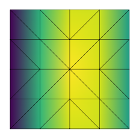

# Python setup for Elmer


```python
import skfem as fem

m = fem.MeshTri.init_sqsymmetric().refined(1).with_boundaries({
    'left': lambda x: x[0] == 0,
    'right': lambda x: x[0] == 1,
})
m  # use this in Elmer?
```


```python
sif = """
Check Keywords "Warn"

Header
  Mesh DB "." "."
End

Simulation
  Max Output Level = 5
  Coordinate System = Cartesian
  Simulation Type = Steady
  Output Intervals(1) = 1
  Steady State Max Iterations = 1
  Post File = "results.vtu"
End
"""
```


```python
sif += """
Body 1
  Equation = 1
  Body Force = 1
End

Body Force 1 :: Source = Real 1.0
Equation 1 :: Active Solvers(1) = 1

Solver 1
  Equation = "Poisson"
  Variable = "Potential"
  Variable DOFs = 1
  Procedure = "Poisson" "PoissonSolver"
  Linear System Solver = "Direct"
  Linear System Direct Method = UMFPack
  Steady State Convergence Tolerance = 1e-09
End

Boundary Condition 1
  Target Boundaries(1) = {left}  ! named boundary
  Potential = Real 0
End

Boundary Condition 2
  Target Boundaries(1) = {right} ! named boundary
  Potential = Real 0.1
End

"""
```


```python
import elmer

case = elmer.Case(m, sif)
results = case.run(
    fetch='results_t0001.vtu',
    verbose=True,
)
```

    Pulling from kinnala/elmer
    Digest: sha256:2a19d445a8fa0d455ce2aa99355661fb7f80df497f82e0a161580efdfbafc7ff
    Status: Image is up to date for ghcr.io/kinnala/elmer:devel-ba15974
    ELMER SOLVER (v 9.0) STARTED AT: 2021/06/30 15:12:16
    ParCommInit:  Initialize #PEs:            1
    MAIN: 
    MAIN: =============================================================
    MAIN: ElmerSolver finite element software, Welcome!
    MAIN: This program is free software licensed under (L)GPL
    MAIN: Copyright 1st April 1995 - , CSC - IT Center for Science Ltd.
    MAIN: Webpage http://www.csc.fi/elmer, Email elmeradm@csc.fi
    MAIN: Version: 9.0 (Rev: ba15974, Compiled: 2021-06-29)
    MAIN:  Running one task without MPI parallelization.
    MAIN:  Running with just one thread per task.
    MAIN: =============================================================
    LoadInputFile: Trying to read "Run Control" section only
    MAIN: 
    MAIN: 
    MAIN: -------------------------------------
    MAIN: Reading Model: /tmp89teo4y0.sif
    LoadInputFile: Scanning input file: /tmp89teo4y0.sif
    LoadInputFile: Scanning only size info
    LoadInputFile: First time visiting
    LoadInputFile: Reading base load of sif file
    LoadInputFile: Loading input file: /tmp89teo4y0.sif
    LoadInputFile: Reading base load of sif file
    LoadInputFile: Number of BCs: 2
    LoadInputFile: Number of Body Forces: 1
    LoadInputFile: Number of Initial Conditions: 0
    LoadInputFile: Number of Materials: 0
    LoadInputFile: Number of Equations: 1
    LoadInputFile: Number of Solvers: 1
    LoadInputFile: Number of Bodies: 1
    ElmerAsciiMesh: Base mesh name: ./.
    LoadMesh: Elapsed REAL time:     0.0001 (s)
    MAIN: -------------------------------------
    AddVtuOutputSolverHack: Adding ResultOutputSolver to write VTU output in file: results
    OptimizeBandwidth: ---------------------------------------------------------
    OptimizeBandwidth: Computing matrix structure for: poisson...done.
    OptimizeBandwidth: Half bandwidth without optimization: 18
    OptimizeBandwidth: 
    OptimizeBandwidth: Bandwidth Optimization ...done.
    OptimizeBandwidth: Half bandwidth after optimization: 10
    OptimizeBandwidth: ---------------------------------------------------------
    ElmerSolver: Number of timesteps to be saved: 1
    MAIN: 
    MAIN: -------------------------------------
    MAIN:  Steady state iteration:            1
    MAIN: -------------------------------------
    MAIN: 
    ComputeChange: NS (ITER=1) (NRM,RELC): ( 0.12856068      2.0000000     ) :: poisson
    ComputeChange: SS (ITER=1) (NRM,RELC): ( 0.12856068      2.0000000     ) :: poisson
    ResultOutputSolver: -------------------------------------
    ResultOutputSolver: Saving with prefix: results
    ResultOutputSolver: Creating list for saving - if not present
    CreateListForSaving: Field Variables for Saving
    ResultOutputSolver: Saving in unstructured VTK XML (.vtu) format
    VtuOutputSolver: Saving results in VTK XML format with prefix: results
    VtuOutputSolver: Saving number of partitions: 1
    ResultOutputSolver: -------------------------------------
    ElmerSolver: *** Elmer Solver: ALL DONE ***
    ElmerSolver: The end
    SOLVER TOTAL TIME(CPU,REAL):         0.04        0.04
    ELMER SOLVER FINISHED AT: 2021/06/30 15:12:16
    


```python
results
```


    <meshio mesh object>
      Number of points: 25
      Number of cells:
        triangle: 32
        line: 16
      Point data: potential
      Cell data: GeometryIds


```python
results.point_data['potential']
```


    array([[0.        ],
           [0.16904762],
           [0.1       ],
           [0.        ],
           [0.18095238],
           [0.1       ],
           [0.        ],
           [0.16904762],
           [0.1       ],
           [0.1172619 ],
           [0.        ],
           [0.11875   ],
           [0.1672619 ],
           [0.175     ],
           [0.16875   ],
           [0.1       ],
           [0.1202381 ],
           [0.        ],
           [0.1702381 ],
           [0.11875   ],
           [0.175     ],
           [0.16875   ],
           [0.1       ],
           [0.1172619 ],
           [0.1672619 ]])


```python
from skfem.visuals.matplotlib import plot, draw, show

ax = draw(m)
plot(m, results.point_data['potential'].flatten(), ax=ax, shading='gouraud')
```


    <matplotlib.axes._subplots.AxesSubplot at 0x7ff9ba6e45e0>





```python

```
